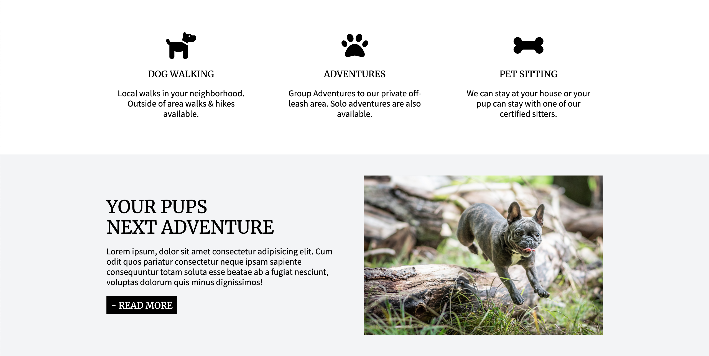

# Adventures in DoggySitting
A concept site for a dog walking and pet sitting business.

**Link to project:** https://adventures-in-doggysitting.netlify.app/

## How It's Made:

**Tech used:** HTML, CSS

This is a static site using HTML and CSS for styling. The links in the navigation do not go to additional pages. It is just a mock up of what the main content for the business.

## Lessons Learned:

This site was good practice for basic CSS styling. It gave many opportunities to work on responsiveness and finding the appropreate breakpoints for different screen sizing. The content of the site is what determened when breaks needed to happen.